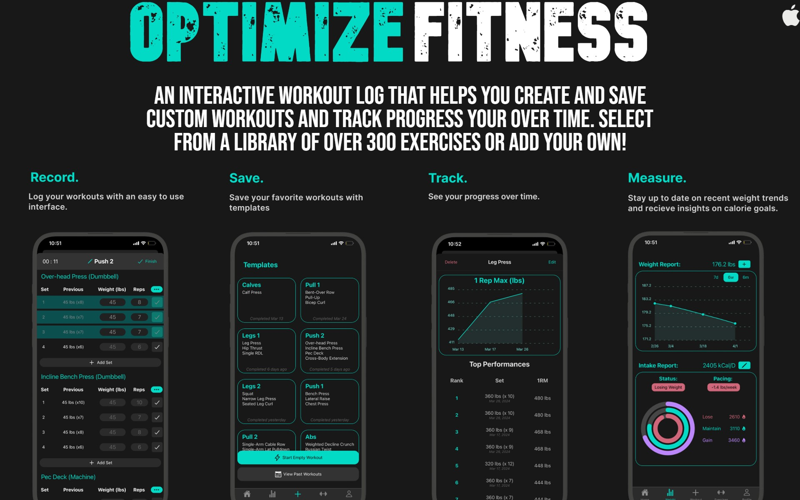

# Optimize Fitness

Optimize Fitness is an interactive workout log created to rival the top paid workout apps; implementing the key features without the paywall.

-Log and track your workouts over time with over 300 exercises to choose from. Can't find what you're looking for? You can add your own!\n
-Works entirely offline making sure your workouts never get interrupted due to poor cellphone service.\n
-Save workouts as templates for easy re-use. Makes planning your next workout a breeze.\n
-Customizable rest timers for each exercises with built in notification support to let you know when its time to get back to work.\n\n

Available for iOS on the App Store: [here](https://apps.apple.com/us/app/optimize-fitness/id6472675277)
